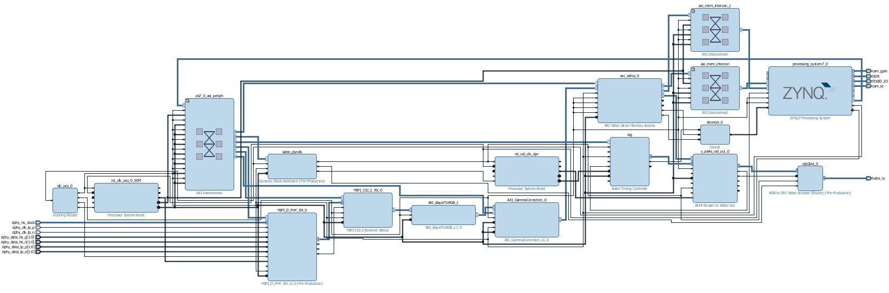

# Code Explaining

Here we're going to dig into the code to understand every action of it. When we know where the PCam stream is handled, then we can modify it to our needs (with some filters).

This projectis mostly written in IP-blocks. This means that all logic is written for us in 1 (or more) blocks. We can examinate the written VHDL code or we can just read the name of the IP-block. Most of the times the name says it all. One other "dificulty" thing is that they use the SDK design for coding HDMI.

## Code in Vivado 2016.4

The block design is complex as we can see in the picture above. 
