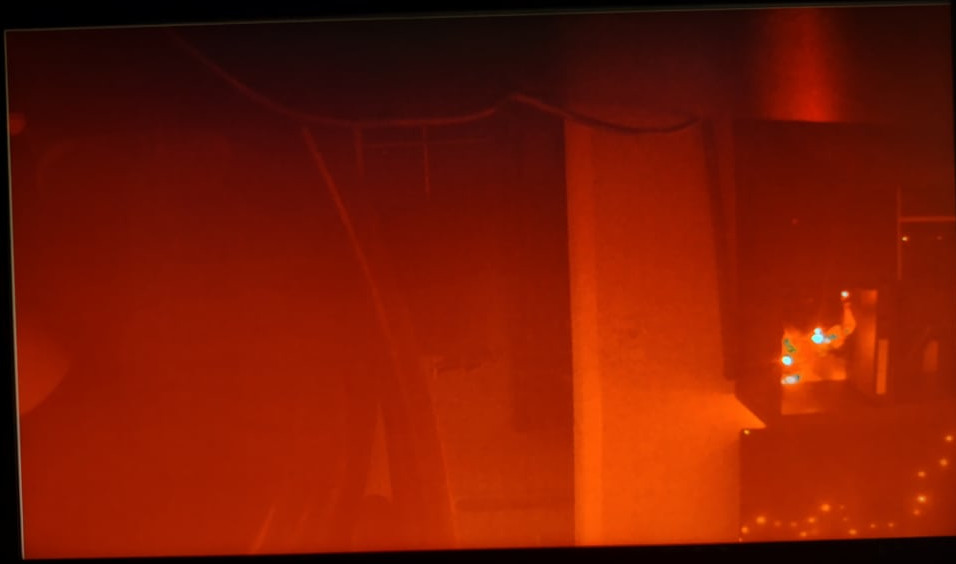
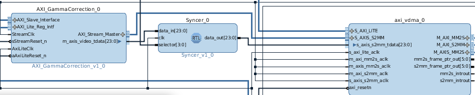

# Implementation

Dit zijn de kern stappen die ik ga volgen in dit project:

1. Installeer Vivado Design Suite & Xilinx SDK 2016.4,
2. Download het tutorial project van [hier](https://digilent.com/reference/learn/programmable-logic/tutorials/zybo-z7-pcam-5c-demo/start),
3. Start en evalueer/ onderzoek het tutorial project.
4. Probeer een filter in de flow te verwerken.

## Tutorial

Als we even naar de tutorial's pagina gaan, dan zien we dat we niet enkel en alleen het tutorial project moeten downloaden. We hebben ook nog board-files nodig.

?> **board-files** beschrijven een evaluation board zoals type FPGA, Boudrate, hoeveelheid flipflops etc.

[Hier](https://digilent.com/reference/software/vivado/board-files) een tutorial om board-files te importeren in Vivado 2016.4. [Dit](https://github.com/Digilent/vivado-boards/) is de GitRepo van de nodige board-files. 

Na het downloaden en installeren van Vivado Design Suite & Xilinx SDK 2016.4 en het inporteren van de juiste board-files gaan we het [tutorial project](https://github.com/Digilent/Zybo-Z7-20-pcam-5c/releases/download/v2016.4-1/Zybo-Z7-20-pcam-5c-2016.4-1.zip) downloaden en openen in Vivado Design Suite.

!> **OPGELET** er zijn nog andere versies ter beschikking op de [GitHub Pagina](https://github.com/Digilent/Zybo-Z7-20-pcam-5c/releases). Wij gaan versie 2016.4 nemen zoals in de tutorial.

Stappen
1. kopieer de bestands locatie van ```create_project.tcl``` die zich in de folder ```proj``` bevind. 
2. Open Vivado 2016.4
   * Als je nog een andere versie hebt, ga dan naar de installatie folder ***(meestal direct op de C schijf)*** van Vivado 2016.4 en zoek naar een batch bestand genaamd ***vivado.bat*** in de folder ```Vivado/2016.4/bin/```.
3. Type onderaan in vivado bij ***Type a Tcl command here*** ```cd (HET BESTANDS PAD)``` zonder haakjes er rond. Belangrijk is dat je de backslashes ```\``` veranderd door forward slaches ```/```. 
   * ***cd c:\user\a\b\create_project.tcl*** wordt dan ***cd c:/user/a/b/create_project.tcl***.
4. Na het commando cd gaan we volgend commando ingeven ```source ./create_project.tcl```. Dit commando zal voor ons het project aanmaken zodat we het kunnen bekijken en eventueel kunnen bewerken.
5. We gaan nu de bitstream genereren door onderaan op ***Generate Bitstream*** te drukken in het venster Flow Navigator.
6. Wanneer de bitstream gegenereerd is, gaan we de hardware definities exporteren met de bitstream bij via ```File -> Export -> Export Hardware```.
7. We gaan nu de SDK openenen van Vivado via ```File -> Launch SDK```.
8. Om het project te importeren gaan we in de SDK window op ```File -> Import``` drukken.
   1. Vervolgens op ```General -> Existing Project into Workspace```
   2. Nadien selecteren we de root directory dat de folder ***SDK*** is.
   3. Als laatste drukken we op de knop ```Select All``` en vinken we ```Copy projects into workspace```.
9. Nu moeten we ons Zybo Z7-20 board programmeren met de gegenereerde bitstream file. Hiervoor gaan we naar ```Xilinx Tools -> Program FPGA```.
10. Als laatste gaan we het gemaakte programma in C++ uploaden naar ons Zybo Z7-20 board. Dit doen we door rechter muisknop op ```pcam_vdma_hdmi``` dan ```Run As``` -> ```1 Launch On Hardware (System Debugger)```.

Als je een error ontving, kijk dan na of de jumper **JP5** op **JTAG** staat. Als dit het geval is, reset en herhaal stap 9 en 10.

Kijk uiteraard ook of dat de Zybo Z7-20 board aanstaat.

Na het succesvol programmeren, zou je dit moeten zien in een seriële monitor (zoals [PuTTY](https://www.putty.org/) of [Tera Term](https://ttssh2.osdn.jp/index.html.en)).


In de seriële monitor kunnen we nu wat instellingen wijzigen en een paar register waardes opvragen van de Pcam 5C.

Niet te vergeten is de video output op de HDMI display.


Het werkt! Dat betekend dat het tijd is om het Block Design te inspecteren en de blokken die er gebruikt worden. Zo kunnen we bepalen waar we de filters kunnen plaatsen.

# data divider

## Where is the data?!

Als we het Block Design openen, dan zien we rechts vanonder dat zich daar de output bevind van de HDMI (HDMI_TX). Voordat we onze data naar de HDMI sturen, moet deze geconverteerd worden van RGB naar DVI.


voor de blok "rgb2dvi_0" zal dus de rgb waarden voorkomen. Dit gaan we opvangen en bewerken. Omdat ik hier nog geen enkele ervaring mee heb om met IP-blocks een hele schakeling op te bouwen, zal het niet vanzelf gaan.

We weten nu via [deze](https://www.xilinx.com/content/dam/xilinx/support/documentation/ip_documentation/v_axi4s_vid_out/v4_0/pg044_v_axis_vid_out.pdf) datasheet van AXI4-Stream to Video Out dat **vid_active_video** een vector bevat van 24. Elke 8'ste bit van de vector stelt een rgb waarde voor. 

* 0-7 GREEN
* 8-15 BLUE
* 16-23 RED


We gaan de data dus moeten opsplitsen in telkens 8 bits om elke kleur afzonderlijk te filteren. 

Na wat zoeken heb ik de IP-blokken gevonden [slice and concat](https://support.xilinx.com/s/article/60844?language=en_US). De slice gaan we kunnen gebruiken om een vector op te delen in kleinere vectoren en de concat om meerdere kleinere vectoren samen te voegen tot één grote vector. We moeten zeker rekening houden dat we de RGB ook terug op de juiste volgorde samenvoegen.

Ook niet onbelangrijk is dat we de andere uitgangen van ***v_axi4s_vid_out_0*** juist verbinden met de ingangen van ***rgb2dvi_0***.

> Verklaring gebruikte uitgangen ***v_axi4s_vid_out_0***
> 
> |Name|Description|
> |:---|:----------|
> |vid_active_video|Video output data valid.|
> |vid_data[23:0]|De RBG data in een vector van 24 met een opsplitsing van 8 per kleur. Deze gaan we opsplitsen.|
> |vid_hsync|Video output horizontal sync.|
> |vid_vsync|Video output vertical sync.|

> Verklaring gebruikte ingangen ***rgb2dvi_0***
> 
> |Name|Description|
> |:---|:----------|
> |vid_pData[23:0]|Video pixel data packed as RBG|
> |vid_pHSync|Horizontal synchronization video timing signal.|
> |vid_pVSync|Vertical synchronization video timing signal.|
> |vid_pVDE|Video data valid: 1 = Active video. 0 = Blanking period.|

## Hooking up


* vid_active_video -> vid_pVDE
* vid_hsync -> vid_pHSync
* vid_vsync -> vid_pVSync

Nu dat deze zijn aangesloten is het tijd om eens met de gevonden (slice & concat) IP-blocks te experimenteren. We gaan **vid_data[23:0]** slicen in 3 verschillende vectoren met elks een lengte van 8. Nadien gaan we deze terug samenbrengen naar een vector van 23.

### Slice
De slice IP-block bevat een ingang die van [x:0] gaat en een uitgang die een deel van de ingang doorgeeft. Wij gaan in dit geval een ingang ontvangen die van [23:0] gaat en een uitgang die van [7:0]. Omdat we in de [23:0] vector, 3 andere vectoren gaan halen is het van belang dat we beschrijven hoe we dit doen.

We gaan het menu van de slice even verduidelijken.

|Name|Description|
|:---|:----------|
|Din Width|The bit of the input bus where bits will be ripped off.|
|Din From|The highest bit to be ripped off.|
|Din Down To|The lowest bit to be ripped off.|
|Dout Width|The width of the output vector|


Even benaderen hoe we de [23:0] slicen om hiervan de eerste byte te verkrijgen die van [7-0] gaat (wat de kleur groen voorstelt).

|Name|Value|Description|
|:---|:----------|:-----|
|Din Width|24|The input bus is [23:0] wich means it is 24 bits long|
|Din From|7|We start at bit 7|
|Din Down To|0| We end at the end wich is bit 0|

Dit proces gaan we herhalen voor elke kleur. 

Na de slice IP-Blocks te hebben ingesteld, gaan we ze nu verbinden met de ***v_axi4s_vid_out_0*** op poort ***vid_data[23:0]***. Ik heb de slice IP-blokken op volgorde gezet gaande van bovenaan is groen, midden is Blauw en onderaan is rood. Hieronder een foto.


### Concat

Om nu de data terug samen te brengen hebben we het concat IP-Block nodig. Deze zal de 3 (kleur) vectoren van [7:0] samenvoegen en terug naar een vector van [23:0] omzetten. 

Even de instellingen uitleggen.

|Name|Description|
|:---|:----------|
|Number of ports|The amount of ports we need to concat the data.|
|Inx Width|The bit of the input bus.|

In ons geval gaan we dus 3 ingangen nodig hebben die elks 8 bits bevatten. 

|Name|Value|Description|
|:---|:----------|:-----|
|Number of ports|3|3 inputs|
|Din From|7|We start at bit 7|
|In0 Width|8|8 bits input|
|In1 Width|8|8 bits input|
|In2 Width|8|8 bits input|

Bij het aansluiten van de slice's naar de concat IP-Block moeten we rekening houden met de volgorden. De concat block zal In0 als LSB beschouden en hierop verder gaan. Wij gaan dus eerst de vector van de kleur groen, dan de vector van de kleur blauw en als laatste de kleur rood. Hieronder een foto.


Als laatste connecteren we de concat IP-Block.


Na de bitstream aanmaken, zouden we hetzelfde resultaat moeten te zien krijgen.

## Result 
> 
> Het beeld was een beetje verschoven en de kleur wit was meer richting rood
> 
> **De oorzaak hiervan ligt denk ik aan het feit dat de IP-block rgb2dvi_0 de VSync en HSync bits vele eerder krijgt dan de RGB-data waardoor er een verschuiving ontstaat.**

# data filtering
Nu we weten hoe de de RGB waardes kunnen scheiden van elkaar, kunnen we eens proberen om hier een filter op toe te passen. We gaan zelf een "filter" maken in VHDL en deze nadien toevoegen aan de block design. 

## First "filter"
We gaan eerst gewoon proberen om een 8 bit vector te shiften naar links met 2 bits en nadien terug naar buiten te sturen. We gaan dit met de kleur rood doen.

``` VHDL
entity Filter is
    Port ( data_in : in STD_LOGIC_VECTOR (7 downto 0);
           data_out : out STD_LOGIC_VECTOR (7 downto 0));
end Filter;

architecture Behavioral of Filter is

signal tempData: STD_LOGIC_VECTOR (7 downto 0);

begin

process(data_in, tempData)
begin

tempData <= data_in;
data_out <= "00000000";
data_out(7 downto 2) <= tempData(5 downto 0); --We verschuiven 2 bits

end process;
end Behavioral;
```

Wat bovestaande VHDL code zal doen is 
1. De 8 bit kleur waarde binnen nemen,
2. Opslaan in een tijdelijke variabelen (gebruiken we later),
3. De uitgang volledig op 0 plaatsen en enkel bit [5-0] naar bit [7-2] verplaatsen.

Op deze manier wordt de kleur rood versterkt met een factor van 2. 

> voorbeeld
> 
> - data_in = 1011 0101 
> - data_out[7-2] = data_in[5-0]
> - data_out = 1101 0100

Deze moment hebben we een component gemaakt maar nog niet geïmporteerd in onze block design.

Stappen om de filter te importeren in het block design
1. Om onze filter toe te voegen aan het block design, gaan we even terug naar het block design in Vivado via ```IP Integrator -> Open Block Design``` bij ```Flow Navigator```.
2. rechtermuisklik ergens in het block design en ga naar de optie ```Add Module```.
3. Selecteer de gemaakte component (In dit geval genaamd ***Filter***) en druk op OK.


Nu gaan we de 1ste slice afkoppelen van de concat en onze geïmporteerde block tussen beide plaatsen.


Als we nu opnieuw de bitstream genereren en de hardware exporteren, dan krijgen we een popup bij het SDK window waarin staat dat de hardware definities verander zijn. We selecteren ```Yes```.

Na de update voeren we stap 9 en 10 van [Tutorial](#tutorial) uit.

Als we de video output erbij halen dan zien we dat het plots veel roder is geworden. Dit kan kloppen omdat we de rode vector hebben versterkt met factor 2.


Om de filter iets dynamischer te maken gaan we 2 switches gebruiken van de Zybo Z7-20 board. De switches zullen het aantal bits voorstellen dat we gaan opschuiven naar links beginnend van 0 en eindigend met 3. We nemen hiervoor **SW0** en **SW1**.

``` VHDL
entity Filter is
    Port ( data_in : in STD_LOGIC_VECTOR (7 downto 0);
           data_out : out STD_LOGIC_VECTOR (7 downto 0);
           div : in STD_LOGIC_VECTOR (1 downto 0));
end Filter;
architecture Behavioral of Filter is
signal tempData: STD_LOGIC_VECTOR (7 downto 0);

begin

process(data_in, tempData)

begin
tempData <= data_in;
data_out <= "00000000";

    case (div) is
      when "00" => --factor 0
        data_out(7 downto 0) <= tempData(7 downto 0); --We verschuiven 0 bits
      when "01" => --factor 1
        data_out(7 downto 1) <= tempData(6 downto 0); --We verschuiven 1 bits
      when "10" => --factor 2
        data_out(7 downto 2) <= tempData(5 downto 0); --We verschuiven 2 bits
      when "11" => --factor 3
        data_out(7 downto 3) <= tempData(4 downto 0); --We verschuiven 3 bits
    end case;

end process;
end Behavioral;
```

In de code hierboven is te zien dat we de switches als ```div``` hebben gedeclareerd. De rest is duidelijk op het eerste zicht.

We zien nu bovenaan dat er een popup is gekomen die zegt dat de module ***out-of-date*** is. Deze moeten we refreshen vooraleer we verder gaan.


Omdat de externe switches gebruikt worden, gaan we dit in ons Block Design moeten specifiëren. 
We klikken op de ***div[1:0]*** input van onze filter en nadien op het icoontje ```Make External``` of ```Ctrl+T```.Het kan ook zijn dat de output pin ***div[1:0]*** vanzelf is geïnporteerd links bovenaan de block design. Als dit is dan moet je het gewoon verbinden met de ***div[1:0]*** input van onze filter.


Ook moeten we het .xdc bestand aanpassen in de folder ***constrains*** zodat Vivado weet welke pinnen we bedoelen.


Nu rest ons nog de bitstream aan te maken en weer de hardware exporteren zoals we al eerder hebben gedaan bij het importeren van de filter. Ook om de SDK up te daten en de FPGA opnieuw programmeren.





We zien duidelijk de standen van onze filter.

## Advanced filter

We kunnen nu een uitgebreide filter maken die verschillende masks kan bevatten om bv. enkel de 4 eerste bits door te laten of een XOR op uit te voeren. De mogelijkheden zijn eindeloos.

De uitgebreide filter

``` VHDL
entity FilterSpecial is
    Port ( data_in : in STD_LOGIC_VECTOR (7 downto 0);
           data_out : out STD_LOGIC_VECTOR (7 downto 0);
           selector : in STD_LOGIC_VECTOR (3 downto 0));
end FilterSpecial;

architecture Behavioral of FilterSpecial is

signal temp_data: STD_LOGIC_VECTOR (7 downto 0) :="00000000";
constant mask_1: STD_LOGIC_VECTOR (7 downto 0) :="00000000";
constant mask_2: STD_LOGIC_VECTOR (7 downto 0) :="00001111";
constant mask_3: STD_LOGIC_VECTOR (7 downto 0) :="11110000";
constant mask_4: STD_LOGIC_VECTOR (7 downto 0) :="11111111";

begin

process (selector, data_in) begin
temp_data <= data_in;


case selector is
    when "0000" => data_out <= temp_data;
    when "0001" => data_out <= (temp_data XOR mask_1);
    when "0010" => data_out <= (temp_data XOR mask_2);
    when "0100" => data_out <= (temp_data XOR mask_3);
    when "1000" => data_out <= (temp_data XOR mask_4);
    when others => data_out <= temp_data;
end case;
end process;

end Behavioral;
```


# Fix video shift

## Change position

Zoals we hebben beschreven in [Resultaat](#resultaat) hebben we een rare image output. Ik dacht dat dit timing gerelateerd was. We gaan eens de slice toepassen op een andere plaats in het block Design.

We gaan de slice - filter - concat tussen de component **AXI_GammaCorrection_0** en **AXI_VDMA_0** plaatsen. Hier hebben we ook de RGB waardes verpakt als 24 bit vector.


wederom geen succes.

i.p.v. maar op 1 datapad een filter te plaatsen, kan ik ook op alle 3 een filter plaatsen. Dit kan misschien ons probleem verhelpen.


tevergeefs was dit ook geen succes.

## Advanced syncer block

We gaan een component maken die zowel de slice zal bevatten, de filter en de concat. En dit alles met een ready pin zodat de timing juist blijft. Ik hoop op deze manier de timings correct te krijgen.

``` VHDL
entity Syncer is
    Port ( valid_in : in STD_LOGIC;
           data_in : in STD_LOGIC_VECTOR (23 downto 0);
           data_out : out STD_LOGIC_VECTOR (23 downto 0);
           valid_out : out STD_LOGIC;
           clk : in STD_LOGIC;
           selector : in STD_LOGIC_VECTOR (3 downto 0));
end Syncer;

architecture Behavioral of Syncer is

component FilterSpecial is
    Port ( data_in : in STD_LOGIC_VECTOR (7 downto 0);
           data_out : out STD_LOGIC_VECTOR (7 downto 0);
           selector : in STD_LOGIC_VECTOR (3 downto 0));
end component FilterSpecial;

signal rood : STD_LOGIC_VECTOR(7 downto 0):="00000000";
signal groen : STD_LOGIC_VECTOR(7 downto 0):="00000000";
signal blauw : STD_LOGIC_VECTOR(7 downto 0):="00000000";

signal rood_out : STD_LOGIC_VECTOR(7 downto 0):="00000000";
signal groen_out : STD_LOGIC_VECTOR(7 downto 0):="00000000";
signal blauw_out : STD_LOGIC_VECTOR(7 downto 0):="00000000";

signal splitsing_ok : STD_LOGIC := '0';

begin

filterRood : FilterSpecial 
port map(data_in => rood, data_out => rood_out, selector => selector);
filterBlauw : FilterSpecial 
port map(data_in => blauw, data_out => blauw_out, selector => selector);
filterGroen : FilterSpecial 
port map(data_in => groen, data_out => groen_out, selector => selector);

process (valid_in, rood, groen, blauw, data_in) begin --data spritsen
if rising_edge(clk) then
    if valid_in = '1' then
        valid_out <= '0';
    
        groen <= data_in(7 downto 0);   --groen data deel
        blauw <= data_in(15 downto 8);  --blauw data deel
        rood <= data_in(23 downto 16);  --rood data deel
    
        splitsing_ok <= '1';
    end if;
end if;
end process;

process (rood_out, blauw_out, groen_out, splitsing_ok) begin
if rising_edge(clk) then
    if(splitsing_ok = '1' AND rood_out /= "00000000") then
        splitsing_ok <= '0';
        data_out <= rood_out & blauw_out & groen_out;
        valid_out <= '1';
    end if;
end if;

end process;

end Behavioral;

```

Zoals we zien in bovenstaande code gaan we onze uitgebreide filter gebruiken als component. Zo maken we onze code modulair als we bijvoorbeeld andere filters willen toepassen. Ook hebben we hier nu een valid in & out die zal zorgen voor de syncronisatie tussen de blokken. Ook een klok input voor extra timing.
De selector voor de filters moeten we ook doorgeven via de syncer blok. Op deze moment heeft elke filter de zelfde selector inputs. Dit kan later eventueel opgesplitst worden.


De aansluiting is nog steeds tussen de **AXI_GammaCorrection_0** en **AXI_VDMA_0** blokken. 

XDC File 

```
#Switches
set_property -dict { PACKAGE_PIN G15   IOSTANDARD LVCMOS33 } [get_ports { div[0] }]; #IO_L19N_T3_VREF_35 Sch=sw[0]
set_property -dict { PACKAGE_PIN P15   IOSTANDARD LVCMOS33 } [get_ports { div[1] }]; #IO_L24P_T3_34 Sch=sw[1]
set_property -dict { PACKAGE_PIN W13   IOSTANDARD LVCMOS33 } [get_ports { div[2] }]; #IO_L4N_T0_34 Sch=sw[2]
set_property -dict { PACKAGE_PIN T16   IOSTANDARD LVCMOS33 } [get_ports { div[3] }]; #IO_L9P_T1_DQS_34 Sch=sw[3]
```

We hebben zoals bij de [Advanced filter](#advanced-filter) gebruik gemaakt van de 4 switches die op onze Zybo Z7 board ter beschikking staan.

Na de bitstream generatie en het programmeren van het board, kregen we een verrassende outout te zien:


Het beeld was zo goed als zwart. Ik denk dat dit lag omdat de andere waardes (tready, tuser, tlast) eerder werden verplaatst dan de data. Ik heb dus de syncer block aangepast zodat we deze data lijnen ook kunnen bijhouden totdat de data klaar is.

Jammer genoeg gaf dit hetzelfde resultaat. 

## Problem continued

Na dat ik opnieuw de originele code heb geüpload en hiermee de data lijnen deel per deel heb opgesplitst en bekeken, heb ik het probleem gevonden.


Zoals we kunnen zien op de foto zijn de datalijnen gewoon verbonden zoals het hoort zonder iets ertussen. Als ik nu enkel lijnen **AXI_Stream_Master** en **S_AXIS_S2MM** verbind zonder tuser, tvaldi, tlast en tdata dan verkrijgen we een perfect beeld. Als ik deze weg laat en de andere met elkaar verbind, verkrijg ik een verschove beeld en de kleuren zijn mee verschoven (blauw wordt rood etc.)

Echter als we ze allemaal verbinden, krijg ik enkel een kleur verschuiving (rood -> groen, groen -> blauw, blauw -> rood) en de beeldverschuiving lijkt weg te zijn. Om onze kleur verschuiving dus op te lossen gaan we eerst een component aanmaken die de kleuren juist zal plaatsen en deze eerst testen. Als dit niet werkt gaan we dit proberen met de slice en concat IP-blokken.

Bij het proberen van deze methode ging het niet zoals verwacht:


De kleuren bleven geshift staan. Ookal veranderde we de volgorden, deed dit niets.

## Problem solved

Ik was ten einde raad dus ik klikte op wat knopjes in de hoop dat het iets deed. En dit deed ook iets wat ik wou. 

De FPGA werd telkens geprogrameerd met de geëxporteerde bitstream file in het SDK programma. Ik heb nu eens de FPGA geprogrammeerd in het Vivado programma (Hardware Manager) en dit gaf een juist resultaat. De kleuren waren niet verschoven. Uiteraard moeten we stap 10 van hoofdstuk [Tutorial](#tutorial) nog wel uitvoeren.

We zullen eens proberen om de syncer block er in te plaatsen. De syncronisatie poorten (tuser, tready, tlast) laten we er uit om de boel wat simpliciteit te geven bij het debuggen.



## Result


# Bronnen
* [Tutorial usage Demo](https://digilent.com/reference/learn/programmable-logic/tutorials/zybo-z7-pcam-5c-demo/start)
* [Tutorial opening project demo](https://digilent.com/reference/learn/programmable-logic/tutorials/github-demos/start)
* [Tutorial importing board files](https://digilent.com/reference/software/vivado/board-files?redirect=1)
* [slice and concat](https://support.xilinx.com/s/article/60844?language=en_US)
* [programming problem](https://forum.digilentinc.com/topic/12952-ap-transaction-error-dap-status-f0000021/) 
* [Demo gitHub repo](https://github.com/Digilent/Zybo-Z7-20-pcam-5c)
* [Board Files gitHub repo](https://github.com/Digilent/vivado-boards/)
* [Zybo z7 reference](https://digilent.com/reference/programmable-logic/zybo-z7/reference-manual)
* [Referencing RTL Modules for use in Vivado IP Integrator](https://www.youtube.com/watch?v=bsvpJYCDmCQ)
* [Case statement](https://www.allaboutcircuits.com/technical-articles/sequential-vhdl-if-and-case-statements/)
* [Variables VHDL](https://www.nandland.com/vhdl/examples/example-variable.html)
* [VHDL Opreators](https://www.csee.umbc.edu/portal/help/VHDL/operator.html)
* [ERROR DRC23-20](https://support.xilinx.com/s/article/56354?language=en_US)
* [Bayer to RGB](https://www.visengi.com/products/bayer2rgb)
* [Paper over video processing](https://digilent.s3-us-west-2.amazonaws.com/resources/whitepapers/EmbeddedVisionDemo.pdf?_ga=2.167079991.807386272.1568825362-2125793643.1506359851)
* [VHDL operators](https://www.ics.uci.edu/~jmoorkan/vhdlref/operator.html)
* [VHDL concat bits](https://stackoverflow.com/questions/209458/concatenating-bits-in-vhdl)

Een link om bayer2RGB aan te passen om eventueel daar de RGB waarde aan te passen [link](https://fumimaker.net/entry/2020/02/06/002934)